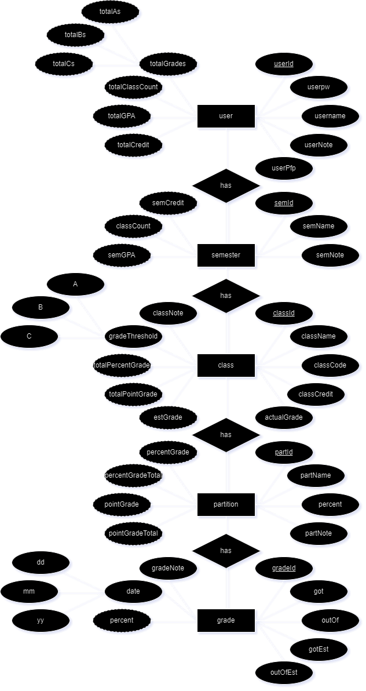

# Goated Grades Tracker

### Description:
  An application for tracking grades.

  As a university student, I am often worried about my grades. 
  Some professors are very quick with posting grades and making sure that they are actualy weighted 
  as they should on the universities official gradebooks (i.e. blackboard or canvas). But some 
  professors are not so kin on putting the grades up or the official gradebooks don't take other 
  factors into calculating the total grades. I wanted to make this application based on what I had
  found lacking in the official gradebooks.

  Theme: Nordic? -> glowy runes and stone / mountain vibe, goats
  
  Mascot/Montro: a graduate goat, Climb and reach for the peak

## Directions:
  By completion *[work in progress]*, should have an out of the box jar or exe application 

## Features:

### MVP:
- [ ] User
  - [x] login
    - [x] SQL - validation
    - [x] Buttons and scene change
    - [x] Error notice
  - [x] registration
    - [x] SQL - add to db
    - [x] Buttons and scene change
    - [x] Error notice
  - [ ] deletion
    - [x] SQL - remove username from db
    - [ ] SQL - remove all other data linked to username
    - [ ] Confirmation window and buttons
      - [ ] Change text to say all data linked to username will also be removed from db
        
- [ ] Main functions
  - [ ] Semester
    - [ ] Add/edit/delete
  - [ ] Class
    - [ ] Add/edit/delete
  - [ ] Partition
    - [ ] Add/edit/delete
  - [ ] Grade
    - [ ] Add/edit/delete
      
- [ ] Data
  - [ ] Import
    - [ ] Conflicts / duplicate handling
  - [ ] Export (in a format that can be imported)
    - [ ] Selection of what to export, which semester/class/everything
        
### Ideal:
- [ ] Custom window
  - [x] The 3 window buttons
  - [x] Moveable window
  - [x] Resizing
  - [ ] Snapping to set sizes
  - [ ] Smooth animations
  - [ ] Nice graphics

- [ ] User
  - [x] Adding a password
  - [ ] Extra other info for the stats
  - [ ] Profile picture

- [ ] Stats
    - [ ] Username, cummulative GPA, total credits, number of As, Bs, Cs, Classes, semesters
    - [ ] Customizablility

- [ ] Data
  - [ ] Export format that is readily useable in a spreadsheet

- [ ] Main functions:
  - [ ] Some kind of drag and drop / sort function on Main functions for easier reorganization
  - [ ] More notes users can add

- [ ] Graphs
  - [ ] Settings
  - [ ] Line
  - [ ] Bar
  - [ ] Pie
  - [ ] Auto default when hover over semester/class

- [ ] Other
  - [ ] Shortcut keys
  - [ ] Hover windows
  
### ERD: 
  Needs some fixing, especially the timeline entity!

 
