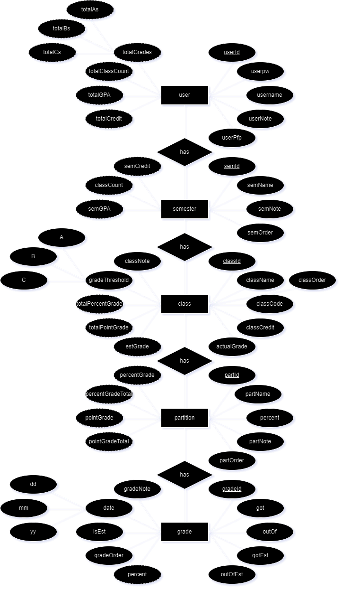

# Goated Grades Tracker

### Description:
  An application for tracking grades.

  As a university student, I am often worried about my grades. 
  Some professors are very quick with posting grades and making sure that they are actualy weighted 
  as they should on the universities official gradebooks (i.e. blackboard or canvas). But some 
  professors are not so kin on putting the grades up or the official gradebooks don't take other 
  factors into calculating the total grades. I wanted to make this application based on what I had
  found lacking in the official gradebooks.

  Icon/mascot: a graduate goat
  
  Montro: Climb to higher hights, up the mountain, reach for higher, better ~~grass~~***grades***

## Directions:
  By completion, should have an out of the box jar or exe application...

## Features:
  - Custom window
    - Done:
      - The 3 window buttons
      - Moveable window
      - Resizing
    - Not done:
      - Snapping
      - Smooth animations/aesthetics

  - User
    - Done:
      - Login
        - SQL part
        - Buttons and scene change
      - Registration
        - SQL part
        - Buttons and scene change
      - Deletion
        - SQL part
        - Confirmation window and buttons

  - Stats
    - Done:
    - Not Done:

  - Grades
    - Done:
    - Not Done:
      - Semester
        - add
        - edit
        - delete
      - Class
      - Partition
      - Grade 
      - Drag and drop components for easier reorganization?
    
  - Data
    - Done:
    - Not Done:
      - Import
      - Export
     
  - Graph
    - Done:
    - Not Done:
      - Settings
      - Line
      - Bar
      - Pie
      - Auto?
  
### ERD:

 
