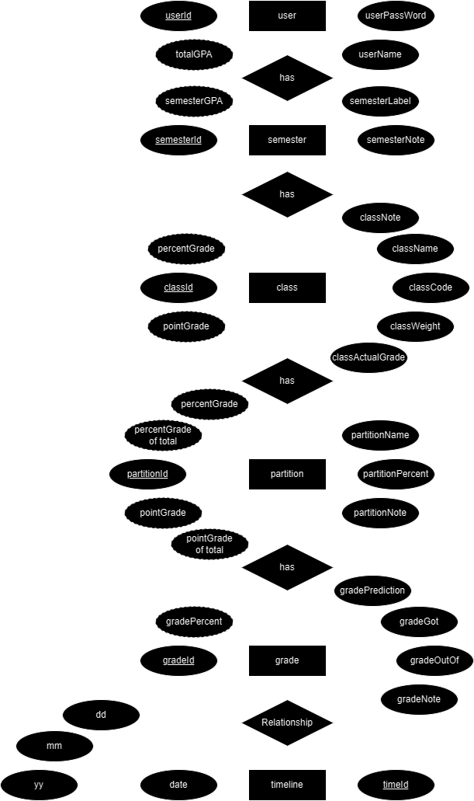

# Goated Grades *Tracker*

  Java application for tracking grades

  Icon/mascot: a goat
  Montro: Climb the mountain, reach for higher ~~grass~~ grades

## Features:

### Complete:

### In Progress:

  - Custom title bar
    - done:
      - the 3 window buttons
      - moveable window
      - resizing
    - not done:
      - snapping
      - smooth animations/aesthetics

### Planned:

  - adding/editing/deleting semesters/classes/partitions/grades
  - user login/registration/deletion

  - Graph for changes in GPA over each term/semester
  - Graph for tracking changes in a class grade
  - Graph for tracking changes in grades over all classes in a semester
  - drag and drop componets for easier reorgainization
  - import/export data
  
## ERD:

 